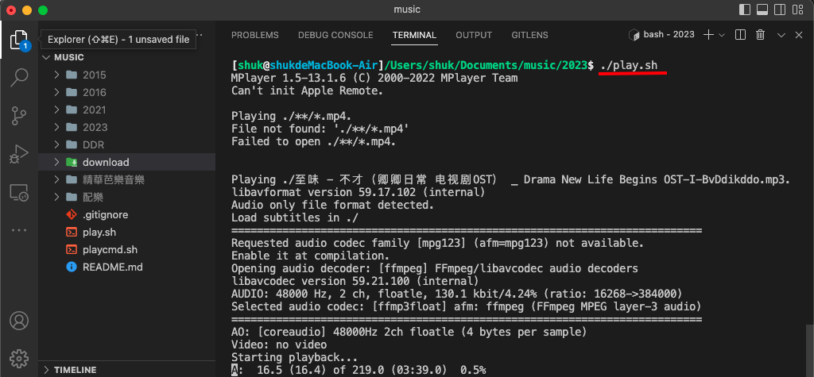

# Music Playing folder template

All folders are music playlist, except download.

download folder is for YT download purpose.

- Move to download folder and use commands below to download YT video and move them to folder you like.

- `./ytmp3-dl.sh <url>` for mp3
- `./ytmp3-dl.sh <url>` for mp4

For YT download options, check `yt-dlp` cmd
If cmd broken, check `ytmp3-dl.sh` and `ytmp4-dl.sh` for details

### Play cmd

All folders have `./play.sh` to play all musice in that folder. The cmd can be generated by `./playcmd.sh`

For changing playing cmd, refer to `mplayer` cmd
